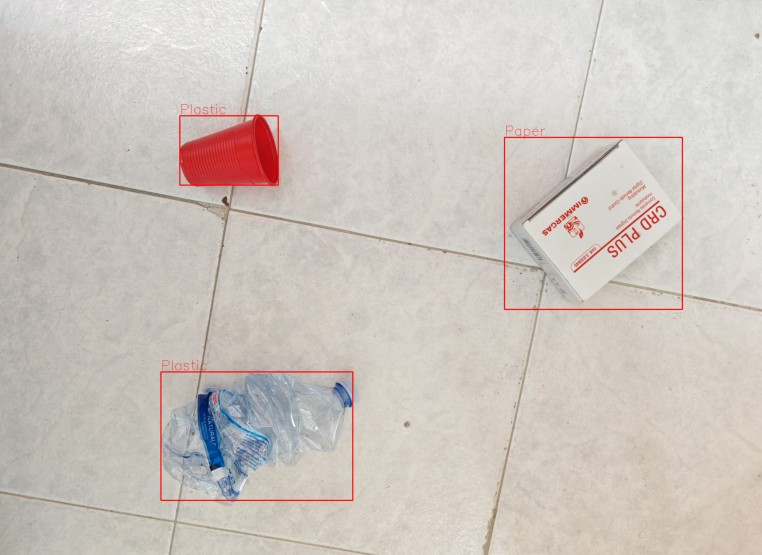

# YOLO-Waste-Detection

**YOLO-Waste-Detection** is an object-detection project built on the Ultralytics YOLOv8 framework to classify and localize five types of waste,Glass, Metal, Paper, Plastic, and Waste in images. 
Waste accumulation in urban and natural environments poses serious threats to human health, biodiversity, and climate. Computer vision offers scalable, accurate, and real-time monitoring of waste streams, enhancing recycling efficiency and supporting proactive environmental management. 

## 📂 Repository Structure

```text
├── Image/                   # Folder containing a test image
├── runs/
│   └── detect/              # YOLOv8 inference outputs (predictions, annotated images)
├── best_model.pt            # Best YOLO model weights
├── Waste_Detection.ipynb    # Interactive Jupyter notebook demonstrating inference & training
├── requirements.txt         # Python dependencies
├── LICENSE                  # Project license
└── README.md                # Project overview
```

## 📊 Dataset

This project leverages the publicly available “Waste Detection” dataset from [utpalpaul108/waste-detection-using-yoloV5](https://github.com/utpalpaul108/waste-detection-using-yoloV5). It contains annotated images of five types of waste.

| 📂 Attribute            | 📈 Details                                                                                           |
|-------------------------|------------------------------------------------------------------------------------------------------|
| **Number of images**    | 4127                                                                                                |
| **Splits**              | • **Train:** 3502 images <br>• **Validation:** 580 images <br>• **Test:** 45 images                  |
| **Classes**             | 5                                                                                                    |
| **Class names**         | `Glass`, `Metal`, `Paper`, `Plastic`, `Waste`                                                         |
| **Source repo**         | [utpalpaul108/waste-detection-using-yoloV5](https://github.com/utpalpaul108/waste-detection-using-yoloV5) |


## ⚙️ Project Content

### Data Handling
- Download & unzip dataset from Google Drive  
- Explore data distribution and visualize sample images

### Model Training & Evaluation
- Train YOLOv8-nano with configurable epoch schedules  
- Track and select the best model based on mAP@0.5  
- Evaluate performance on validation and test splits (mAP@0.5, mAP@0.75, mAP@0.5:0.95)

### Inference & Visualization
- Display predictions on test-set images  
- Test generalization on user-provided photos


## 🧪 Test 
I took a photo with my cell phone to test whether the model can correctly identify the type of waste in an image that is completely different from the ones present in the dataset used to train the model.



## 🔧 Installation

```bash
git clone https://github.com/gianlucasposito/YOLO-Waste-Detection.git    
cd Waste_Detection
pip install -r requirements.txt
